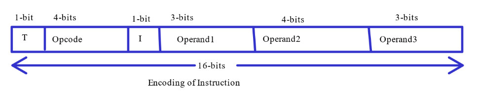

# COA_PROC_SIIM
Simulation of a processor that uses 16 bit instructions

1. Instruction format: Opcode <operand1> <operand2> <operand3> 
2. Instructions: LOAD , STORE , ADD , SUBTRACT , AND , OR , XOR

INSTRUCTION FORMAT:

